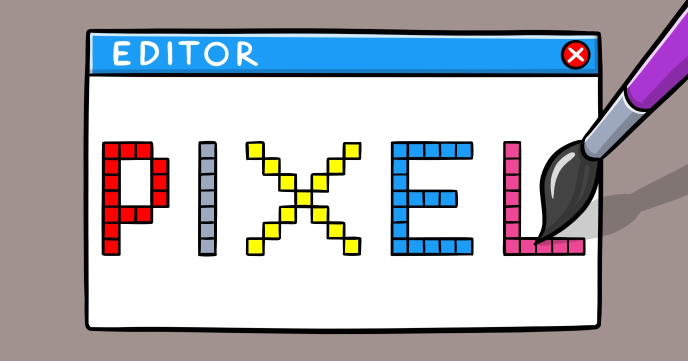

Hello kids! Are you in the mood for the art class?

We hope you are... because in this tutorial we will learn how to create “Blocky” – the very simple image editor that allows you to create your own characters pixel by pixel.

No magnifier glass required - just your mouse!

Feel free to personalize and extend the pixel editor as you with. You can add features such as color selection and various drawing tools.

Also, don’t forget to check the "Color Blocky" - the more advanced version of this editor, with color selection.
 
## Source code 
The JavaScript source code of this program can be found [here](sketches/program.js). To run it, you need to import it in the [codeguppy.com](https://codeguppy.com) online editor. Alternatively, you can use the source code in your p5.js sketches (advanced use). 
## Online version 
To see the code running, check the online playground at [https://codeguppy.com/code.html?t=blocky](https://codeguppy.com/code.html?t=blocky) 
## Next steps 
Please check [codeguppy.com](https://codeguppy.com) for many other fun JavaScript programs and games for beginners. To stay up to date with CodeGuppy development please follow [@codeguppy](https://twitter.com/codeguppy) on Twitter.  
